# Microsoft Teams Lifecycle Policy

While your organization may be well equipped and organized with various team workflows, there might be tens or hundreds of unused/inactive teams that you would like to archive or delete.

## What is Teams Lifecycle?

Teams Lifecycle helps you manage the lifecycle of teams within the Microsoft Teams platform. It allows administrators to establish teams and group's policies based on their activity level. This helps to ensure that inactive teams are identified and managed efficiently.  
With Teams Lifecycle, admins can keep track of teams, monitor their activity levels, and act when necessary to keep the platform organized and running smoothly.

## How does it work?

When a team becomes inactive (no activity for a certain period of time), an email notification is sent to all the owners of the team asking them for action, with a direct link to the team in question.  
After the grace period has ended, if the action is set to `Archive` or `Delete`, an email notification is sent to all the owners of the team mentioning the executed action on that team.

This graphic summarizes the different states of this process:

```mermaid
graph TB
    %% Nodes
    s(["➕ Team creation"])
    active("👍 Active")
    inactive("💤 Inactive")
    expired("🕛 Expired")
    inactivitynotification["📧 Inactivity notification"]
    expirationnotification["📧 Expiration notification"]
    action["📦 Archive/ 🔥 Delete"]
    e([End of life])

    %% Styles
    classDef startend fill:#9099d8, stroke-width:0px;
        class s startend
        class e startend
    
    %% classDef actions fill:whitesmoke, stroke-width:0px;
        %% class inactivitynotification actions
        %% class expirationnotification actions
        %% class action actions

    %% Links
    s --> active
    active -->|"⏳ inactivity period"| inactive
    inactivitynotification --> |"⏳grace period"| expired
    action --> expirationnotification
    expired --> action
    inactive --> inactivitynotification
    %% inactive --> |new activity| active
    inactivitynotification --> |new activity| active
    expirationnotification --> e
```

## What are the available options?

* `Enable`: Turns on/off the lifecycle policy control for teams associated with this template. The lifecycle policy is `disabled` by default.
* `Inactivity` period: The period to wait after the latest recorded activity to trigger the team owner's notification. The inactivity period can be defined as 7, 30, or 90 days. Defaults to \`30\`.
* `Expiration`: The period to wait before triggering the lifecycle policy action. The grace period can be defined as 7 or 30 days. Defaults to \`7\`.
* `Action`: The action to be taken if the grace period has ended, among `None`, `Archive`, or `Delete`. Defaults to \`Archive\`.

:::tip Note
As of today, the "Lifecycle" tab is restricted to users granted the `Change Managers` role.
:::

## How to enable Teams Lifecycle?

1. Go to Microsoft Teams and log into your nBold account.
2. Click on Create a Template or edit an existing one.
3. Go to the "Lifecycle" tab.
4. Click on "Enable lifecycle policy".
5. Enter the number of days of Inactivity and Expiration.
6. Select the Action you would like to take on the teams.

## Requirements

### Microsoft Graph permissions

The service account must have been granted the `Reports.Read.All` and `ReportSettings.Read.All` permissions. You can check the currently granted permissions from the nBold app, through "Settings > Security"

### Microsoft 365 roles

The service account must have the [appropriate authorization](https://learn.microsoft.com/en-us/graph/reportroot-authorization) to read Microsoft 365 usage reports.

### "Display concealed groups" option

By default, Microsoft 365 reports are masking team IDs and names. For the lifecycle policy to work, you have to to switch off the obfuscation feature in the Microsoft 365 admin center settings.  
  
Go to Microsoft Admin Centre - [https://admin.microsoft.com/Adminportal/Home?source=applauncher#/Settings/Services/:/Settings/L1/Reports](https://admin.microsoft.com/Adminportal/Home?source=applauncher#/Settings/Services/:/Settings/L1/Reports "https://admin.microsoft.com/Adminportal/Home?source=applauncher#/Settings/Services/:/Settings/L1/Reports")  
  
Go to "Settings > Org Settings > Services" and select "[Reports](https://admin.microsoft.com/Adminportal/Home?source=applauncher#/Settings/Services/:/Settings/L1/Reports "https://admin.microsoft.com/Adminportal/Home?source=applauncher#/Settings/Services/:/Settings/L1/Reports")" in the list.  
**Make sure the "Display concealed user, group, and site names in all reports" option is disabled and click "Save".**  
You can learn more about this option from "[Microsoft 365 Reports in the admin center](https://docs.microsoft.com/en-us/microsoft-365/admin/activity-reports/activity-reports?view=o365-worldwide "https://docs.microsoft.com/en-us/microsoft-365/admin/activity-reports/activity-reports?view=o365-worldwide")".