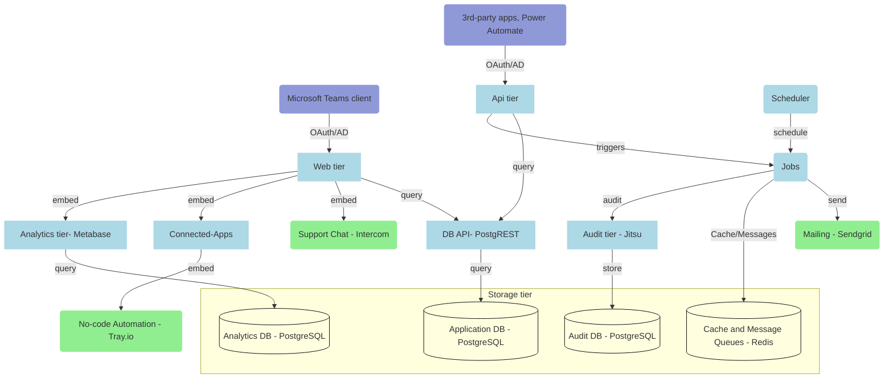
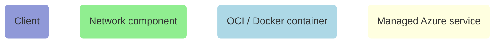
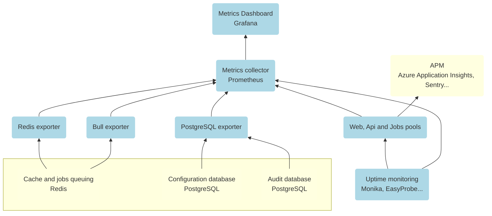

# nBold Self-Hosted

## nBold Cloud vs Self-Hosted

> What’s the difference between nBold Cloud and Self-Hosted?

**There is only ONE version of nBold.**

Both `nBold Cloud` and `nBold Self-Hosted` products are completely equal. There’s NO version with a better or more complete feature set.
You get the same app, same compliance, same metrics and same commitment to respecting your privacy, security and compliance with both.

**Key differences**

Here are the key differences between `nBold Cloud` and `nBold Self-Hosted`:

| | Cloud | Self-hosted |
|---|---|---|
| **Hosting** | Easy and convenient. We manage everything for you so you don’t have to worry about anything. We take care of the installation, upgrades, containers, security, maintenance, uptime, stability, consistency, loading time and so on. | You do it all yourself. You need to get servers / containers and you need to install, maintain and manage nBold on servers / containers. You are responsible for installation, maintenance, upgrades, capacity, uptime, backup and so on. |
| **Storage** | We keep your data on Microsoft Azure in multiple isolated regions for both resiliency and compliance. | You have full control and can host nBold on any servers / containers in any country that you wish. Host it on servers / containers on-premises or host it with any cloud provider wherever you want.|
| **Raw data** | You can access all your data from our intuitive dashboard. N.B: You can only see the stats aggregated in the dashboard. | Hosting nBold yourself gives you the option to take the data directly from the database and import it to a data analysis tool of your choice. |
| **Releases** | Continuously developed and improved with new features and frequent updates. | Latest features won't be immediately available (as opposed to security fixes) as they're battled-tested in the cloud before released to self-hosted environments, but you can expect a new release at least every month.|

## Architecture Overview
nBold is a multi-tier platform that relies on [independent services](https://assets.nbold.io/documentation/services-reference) to support high-availability and scale with ease.
At a glance, a basic and minimal nBold production environment (without network components, operations/monitoring tools) would be comprised of these different elements:



**Legend:**


# Quick-Start

## Prerequisites
To complete this tutorial, you will need:
- An installed and running [Docker server](https://www.docker.com/). If your server doesn't come with Docker pre-installed, you can follow [their docs](https://docs.docker.com/get-docker/) to install it.
- If you are using a Linux system:
  - [curl](https://github.com/curl/curl). Alternatively, you can use `wget`.
  - `zip` and `unzip` commands

## Initialize the project

Create a new directory for the project:
```sh
mkdir nbold
cd nbold
```

Download the Docker Compose file and the sample environment variables:
```sh
curl https://assets.nbold.io/documentation/docker-compose.yml -O docker-compose.yml
curl https://assets.nbold.io/documentation/.env.sample -O .env
```

## Minimal configuration
nBold comes with safe defaults, but you still need to define some settings specific to your environment. To do so, open the `.env` configuration file. It defines most of the configurable aspects of your environment.

Especially, replace `SERVER_HOST` with the actual public host name / FQDN of the server:

```
WEB_PUBLIC_HOST=SERVER_HOST
API_PUBLIC_HOST=SERVER_HOST
AUDIT_SERVICE_URL=https://SERVER_HOST/audit
AUDIT_SERVICE_AUTHORIZED_ORIGIN=SERVER_HOST
ANALYTICS_SERVICE_URL=https://SERVER_HOST/analytics
ANALYTICS_SERVICE_PORTAL=https://SERVER_HOST/analytics-portal
```

Also, create as [new Entra ID App Registration](https://learn.microsoft.com/en-us/power-apps/developer/data-platform/walkthrough-register-app-azure-active-directory) and define the app id and app secret accordingly in the configuration:
```
MICROSOFT_AZURE_AD_APP_CLIENT_ID=
MICROSOFT_AZURE_AD_APP_CLIENT_SECRET=
```

> For more information about all the available configuration settings, please refer to [Configuration Reference](https://assets.nbold.io/documentation/configuration-reference)

## Deploy
You can deploy nBold using Docker Compose:
```sh
docker compose --file ./docker-compose.yml -p nbold-selfhosted --env-file ./.env up
```

You can verify that the server is running by visiting [http://localhost:8000/home](http://localhost:8000/home) (or the FQDN previously defined) in your web browser.

💡 If you kill the previous command by using `CTRL+C` or similar action, your environment will stop. To keep it running in `detached` mode, add the `--detach` option that starts the containers in the background and leaves them running.`

💡 You can view the the list of running containers with:
```sh
docker ps
```

## Final steps
The latest step is to generate a Microsoft Teams package so that you can access nBold from Microsof Teams.

Start by downloading our latest package template from [this URL](https://assets.nbold.io/packages/io.nbold.standalone.self.zip) or from the command line:
```sh
mkdir -p packages/standalone && cd packages/standalone
curl https://assets.nbold.io/packages/io.nbold.standalone.self.zip -o io.nbold.standalone.self.zip
```

Then unzip the package manually or from the command line:
```sh
unzip io.nbold.standalone.self.zip
```

Each package is comprised of the following files:
- `manifest.json`: The main package manifest
- `es-es.json`: Spanish localization file
- `fr-fr.json`: French localization file
- `it-it.json`: Italian localization file
- `color.png`: The package color icon
- `outline.png`: The package outline icon

Then configure the `manifest.json` file by replacing these following placeholders with your actual configuration:
- `[[MICROSOFT_TEAMS_APP_MANIFEST_ID]]`: A unique id to uniquely identify your package, using UUID version 4 format, such as `ea86caa9-2d39-477a-a9af-5f3f6a3829de`. You can use [this tool](https://www.uuidgenerator.net/version4) to generate a new unique one.
- `[[MICROSOFT_TEAMS_APP_MANIFEST_PACKAGE_NAME]]`: A unique name for your package. The recommended format is the [Reverse domain name notation](https://en.wikipedia.org/wiki/Reverse_domain_name_notation), such as `com.example.MyProduct`.
- `[[NBOLD_APP_PUBLICURL]]`: The public URL of your nBold service. by default, use `https://app.salestim.io`.
- `[[MICROSOFT_TEAMS_APP_MANIFEST_VALID_DOMAINS]]`: The list of domains the package is authorized to access.
- `[[MICROSOFT_TEAMS_APP_MANIFEST_WEBAPPLICATIONINFO_ID]]`: The nBold app Microsoft app registration client ID.
- `[[MICROSOFT_TEAMS_APP_MANIFEST_WEBAPPLICATIONINFO_RESOURCE]]`: The nBold Microsoft app registration resource URL.

In addition, you can customize the following other properties:
- `version`: The package version using the [semver](https://semver.org/) format, such as `1.0.0`.
- `name`:
  - `short`:
  - `full`:
- `description`:
  - `short`:
  - `full`:
- `icons`:
  - `color`:
  - `outline`:
- `accentColor`:

Save your updates.

Then build your package by adding all the assets to the zip archive, manually or from the command line:
```sh
zip io.nbold.standalone.self.zip *.json *.png
```

You can now go to Microsoft Teams and upload the package as a custom app.

💡 The `zip` utility is not installed by default in many Linux distributions, but you can easily install it using your distribution package manager if you need it.
```sh
sudo apt install zip
```

# Operations

## Scaling
The following nBold containers are completely stateless, and therefore can be scaled by increasing the number of instances:
- Web
- API
- Jobs

The only exception is the scheduler service that MUST only run in one instance.

For the other third-party services defined in the Docker Compose file, please refer to their respective documentation:
- Redis: [Scale with Redis Cluster](https://redis.io/docs/management/scaling/)
- PostgreSQL: [Creating a database cluster](https://www.postgresql.org/docs/current/creating-cluster.html)
- Jitsu: [Jitsu at scale](https://classic.jitsu.com/docs/deployment/scale)
- Metabase: [Metabase at scale](https://www.metabase.com/learn/administration/metabase-at-scale)

## Upgrading
nBold follows [semantic versioning](https://semver.org/) format: `MAJOR.MINOR.PATCH`

The default `latest` tag of our Docker images always refers to the latest stable release tag. You can also pin your version, for instance:
* `nboldhq/app-platform:v2` pins the major version to `2` but allows minor and patch version upgrades
* `nboldhq/app-platform:v2.2` pins the minor version to `2.2` but allows only patch upgrades

⚠️ Backward compatibility: **None of the functionality is backported to older versions**. If you wish to get the latest bug fixes and security updates you need to upgrade to a newer version.

⚠️ About database schema: Please note that **database schema changes require running migrations when you're upgrading**. However, we consider the schema as an internal API and therefore schema changes are in general not considered a breaking change.

## Backup
The only required permanent storage that must be retained (and backed-up) is for the databases:
- The "primary" database that contains the nBold configuration and metadata
- The "analytics" database (if the analytics service is enabled) that contains the analytics service configuration
- The "audit" database (if the audit service is enabled and uses a dedicated database distinct from the primary database) that contains audit logs.

If you're using Docker, we suggest to perform backups of the `data` volumes for each PostgreSQL container.

## Monitoring
In addition to the core containers defined in the Docker Compose file, here are some of the most common additional operations services, for auditing, uptime monitoring and APM (Application Performance Management):



### Uptime monitoring
To monitor their uptime, each container exposes an HTTP endpoint at `/health`, that answers to `HEAD` and `GET` requests with a `200` empty response.

💡 You can use the `user-agent` HTTP header to identify the monitoring service sending the requests.

For uptime monitoring, you can use any tool such as Monika, EasyProbe, etc.

If you're hosting the solution on Azure, [Azure Front Door](https://docs.microsoft.com/en-us/azure/frontdoor/) comes with health probes that are used to perform load-balancing and achieve failover in case of a container malfunction.

⚠️ About Azure Front Door: Since [Azure Front Door](https://docs.microsoft.com/en-us/azure/frontdoor/) has many edge environments globally, health probe volume for your backends can be quite high, ranging from 25 requests every minute to **as high as 1200 requests per minute**, depending on the configured probe frequency.
For instance, with the default probe frequency of 30 seconds, the requests volume on your backend would be about **200 requests per minute**.

## Logging
Our platform comes with a configurable logging module that generates logs as configured by the [Logging configuration](https://assets.nbold.io/documentation/configuration-reference).

⚠️ Persisting log files: Log files persistence is not enabled by default and we recommend to use an external log ingestion solution in production environments.

As nBold comes with a native connector for Microsoft Application Insights, the easiest and recommended way to collect and centralize all the logs and traces, is to enable and configure the connector from the [Application Insights configuration](https://assets.nbold.io/documentation/configuration-reference).

Application Insights is part of the [Azure Monitor](https://docs.microsoft.com/en-us/azure/azure-monitor/overview) service and uses an Azure Log Analytics Workspace under the hood as a storage. From Application Insights, you can live-monitor the whole nBold platform, investigate issues using traces and events, detect performance bottlenecks... Learn more about [Microsoft Application Insights](https://docs.microsoft.com/en-us/azure/azure-monitor/app/app-insights-overview).

## Application Performance Monitoring (APM)
As nBold comes with a native connector for Microsoft Application Insights, the easiest and recommended way to collect and centralize APM metrics, is to enable and configure the connector from the [Application Insights configuration](/hosting/references/configuration-reference).

Application Insights is part of the [Azure Monitor](https://docs.microsoft.com/en-us/azure/azure-monitor/overview) service and uses an Azure Log Analytics Workspace under the hood as a storage. From Application Insights, you can live-monitor the whole nBold platform, investigate issues using traces and events, detect performance bottlenecks... Learn more about [Microsoft Application Insights](https://docs.microsoft.com/en-us/azure/azure-monitor/app/app-insights-overview).

## Collecting metrics

### Metrics collector
The nBold platform relies on [Prometheus](https://prometheus.io/) to collect and centralize all its metrics.

Prometheus is an open-source software application that is used for event monitoring. It collects metrics such as requests count, duration and exceptions from applications and records them in a time-series database. Prometheus is also used for monitoring CPU status and memory/disk-space usage so it can be used and be represented in a meaningful display.

Prometheus has become widely known and used in software industries due to its open-source and ease of use. Prometheus is a stand alone and self containing application that run by pulling data from services using worker systems that runs periodically.

### Collect application metrics
To expose their metrics, each SalesTIm container exposes an HTTP endpoint at `/monitoring/metrics`, that answers to `GET` requests with a `200` response, using the [Prometheus](https://prometheus.io/) exporter format.

Exported metrics could be configured from the [Prometheus Configuration](https://assets.nbold.io/documentation/configuration-reference) options.


**Metrics exposed:**
- Default metrics from [prom-client](https://github.com/siimon/prom-client).
- `http_requests_total`: Counter for total requests received, has labels `route`, `method`, `status`
- `http_request_duration_seconds`: - Duration of HTTP requests in seconds, has labels `route`, `method`, `status`

Notes:
1. Standard nodejs exposed metrics are prefixed by `nb_`
2. The labels `route` and `status` are normalized:
- `route`: will normalize id like route params
- `status`: will normalize to status code family groups, like `2XX` or `4XX`.

⚠️ How to secure the metrics endpoint? In production, you can secure the `/health` endpoint to prevent any technical information leak. To do so, define the `PROMETHEUS_EXPORTER_AUTH_TOKEN` property from the [Prometheus Configuration](https://assets.nbold.io/documentation/configuration-reference) options.  

💡 A convenient way to generate a secure token is to use the `openssl` command, such as:
```sh
# The rand command encodes the produced random bytes in base64. This encoding converts bytes to alphanumeric characters, including the characters `=`, `+`, and `/`. These characters are filtered to have passwords without special characters and prevent url encoding issues. It reduces the random character of the token a little bit, but is not a concern when the token is more than 10 characters.
openssl rand -base64 29 | tr -d "=+/" | cut -c1-25
```

### Collect Redis cache metrics
Redis metrics can be exported by using a [Redis Prometheus exporter](https://github.com/oliver006/redis_exporter) container.
Most items from the `INFO` command are exported, see [Redis INFO command documentation](https://redis.io/commands/info) for details.

### Collect Redis queues metrics
nBold uses the [Bull](https://github.com/OptimalBits/bull) module to manage its asynchronous jobs. Bull is a Queue package for handling distributed jobs and messages in NodeJS.

To monitor Bull queues, you can use a [Bull Prometheus exporter](https://github.com/UpHabit/bull_exporter) container.
Most items from the `INFO` command are exported, see [Redis INFO command documentation](https://redis.io/commands/info) for details.

**Metrics exposed:**

| Metric                       | type    | description |
|------------------------------|---------|-------------|
| `bull_queue_completed`         | counter | Total number of completed jobs                          |
| `bull_queue_complete_duration` | summary | Processing time for completed jobs                      |
| `bull_queue_active`            | counter | Total number of active jobs (currently being processed) |
| `bull_queue_delayed`           | counter | Total number of jobs that will run in the future        |
| `bull_queue_failed`            | counter | Total number of failed jobs                             |
| `bull_queue_waiting`           | counter | Total number of jobs waiting to be processed            |

## Auditing
To see the list au audited events, you can refer to the [Events reference](https://assets.nbold.io/documentation/events-reference) documentation, and look for events with the `Tracking` configuration:
- Enabled: `true`
- Audit trail: `true`

Exporting audit trails from the audit database:
Our [Events reference](https://assets.nbold.io/documentation/events-reference) documentation also specifies the mapping between an audited event and its representation in the audit database:
- Table: Tracking `Code`
- Columns: Tracking `Audited fields` 
