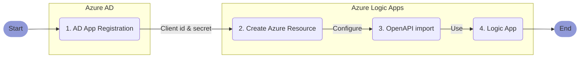

# Setup the Automation Connector for Logic Apps

**Abstract**  
This article explains how to register the nBold Connector as a custom connector for Azure [Logic Apps](https://docs.microsoft.com/en-us/azure/logic-apps/).

::: tip ⏱ Expected Duration
Creating the custom connector only requires a few operations that are described hereafter as a detailed step-by-step procedure. Assuming you have all the required access and permissions to execute it properly, it should take ***less than 10 minutes***.
:::

---

**TABLE OF CONTENTS**:
[[toc]]

---

## Procedure Overview
Here is an overview of the overall procedure:



## 1. Create a new app registration in Azure Active Directory
To securely access your Microsoft 365 environment through the Microsoft Graph APIs, the first step is to create a dedicated app registration. An Azure AD app registration identifies a third-party app such as nBold, and defines the permissions you wan to grant to it. To learn more, you can refer to [How and why applications are added to Azure AD](https://docs.microsoft.com/en-us/azure/active-directory/develop/active-directory-how-applications-are-added).

To create a new app registration, follow these steps:
- Open your [Azure Active Directory portal](https://portal.azure.com/#blade/Microsoft_AAD_IAM/ActiveDirectoryMenuBlade/Overview)
- Select `App registrations` from the left menu
- Click `New registration` from the top bar
- Give the app a name, such as:
---
```
nBold Logic Apps Connector
```
---
- Select the option `Accounts in this organizational directory only`, as you want to restrict access to your own tenant.
- Use this web redirection URL:
---
```
https://global.consent.azure-apim.net/redirect
```
---
- Click `Register`
- From the `Overview` menu, copy the `Application (client) ID`, and keep it as we're gonna reuse it later. You can temporarily paste it here:

**Application (client) ID**:  
<input type="text" id="clientIdInput" style="width: 500px;" placeholder="Paste your Application ID here"></input>

- Open the `Authentication` menu
- Ensure that the `Access tokens (used for implicit flows)` and `ID tokens (used for implicit and hybrid flows)` options are chacked from the `Implicit grant and hybrid flows` section, and save your updates if required.
- Open the `Certificates and secrets` menu and click `New client secret`. A client secret is a kind of a password for your app, so manage it carefully.
- Give a name to your client secret such as:
---
```
nBold Logic Apps Connector client secret
```
---
- Select the expiration option, and click `Add`
- Copy the `Client secret` value (be careful, it will only be shown once), and keep it as we're gonna reuse it later. You can temporarily paste it here:

**Client secret**:  
<input type="text" style="width: 500px;" placeholder="Paste your Client Secret here"></input>

- Open the `API permissions` from the left menu and click `Add a permission` from the top bar
- Select `Microsoft Graph`, then `Delegated permissions`
- From the permissions list, select:
    - OpenId permissions >
        - `email`
        - `offline_access`
        - `openid`
        - `profile`
    - Directory >
        - `Directory.AccessAsUser.All`
    - Group >
        - `Group.ReadWrite.All`
    - InformationProtectionPolicy >
        - `InformationProtectionPolicy.Read`
    - Mail >
        - `Mail.Send`
    - User >
        - `User.Read`
        - `User.Read.All`
- Click `Add permissions`
- Then click `Grant admin consent for...` then `Yes`

You're done, you've created your app registration for the nBold Connector. You should also have saved for later the `Application (client) ID` and `Client secret` that we're gonna use in the next steps.

## 2. Create an Azure Custom Connector Resource
In Azure Logic Apps, you must first create the custom connector resource (steps below) before defining the behavior of the connector using an OpenAPI definition.
- In the Azure portal, on the `Azure services` menu, choose `Create a resource`.
- In New, enter `logic apps custom connector` in the search box as your filter. Select `Logic Apps Custom Connector` from the drop-down box.
- In `Logic Apps Custom Connector`, select `Create`.
- Provide details for registering your connector. When you're done, choose `Review + create`.

Once you've created the custom connector resource, the custom connector menu should open automatically. If it doesn't, you can go to the subscription and resource group you selected and open it directly. Now that you have a custom connector, you can define the connector's behavior.

::: tip Note
For reference, see [Create a custom connector in Azure Logic Apps](https://docs.microsoft.com/en-us/connectors/custom-connectors/create-logic-apps-connector)
:::

## 3. Import the nBold OpenAPI definition
Now that we've created both the app registration and the logic apps resource, we're gonna use it to create our custom connector.
- Go to the Azure portal, and open the Logic Apps connector you created earlier in `Create an Azure Logic Apps custom connector`.
- In your connector's menu, choose `Logic Apps Connector`, then choose `Edit`.
- Under `Custom connectors`, select `REST`
- From `Import mode`, select `OpenAPI URL` and and paste this URL:
---
```
https://raw.githubusercontent.com/nboldhq/docs/main/src/api/latest/definition/power-platform/apiDefinition.swagger.json
```
---
- Click `Import`
- From the `General information` section, give your connector a name, such as:
---
```
nBold
```
---
- Upload the connector logo that you can download from:
---
```
https://nbold.co/wp-content/uploads/2020/12/Logo_degrade_blanc.svg
```
---
- Set the icon background color to:
---
```
#000000
```
---
- Click `Security`
- Ensure that the authentication type is set to `OAuth 2.0` and the identity provider is set to `Azure Active Directory`
- Paste the previously copied `Client id` and `Client secret`
- Ensure that the login url is set to:
---
```
https://login.windows.net
```
---
- Ensure that the tenant ID is set to:
---
```common```
---
- Set the resource URL to:
---
```
https://graph.microsoft.com
```
---
- Set the scope to:
---
```
https://graph.microsoft.com/.default
```
---
- Click `Update connector`
- From the `Security` page, copy the generated `Redirect URL`, and keep it as we're gonna reuse it later. You can temporarily paste it here:

**Redirect URL**:  
<input type="text" id="redirectUrlInput" style="width: 500px;" placeholder="Paste your Redirect URL here"></input>

- Navigate back to your app registration, open the `Authentication` menu
- From the `Web` section, add the previously copied URL to the list of `Redirect URIs`
- Click `Save`

::: tip Note
For reference, see [Import the OpenAPI definition for Logic Apps](https://docs.microsoft.com/en-us/connectors/custom-connectors/define-openapi-definition#import-the-openapi-definition-for-logic-apps)
:::

## 4. Next Steps
Now that you've created the nBold connector, you can use it from your Azure [Logic Apps](https://docs.microsoft.com/en-us/azure/logic-apps/) environment. See the available [Triggers and Actions](/connectors/connectors-actions) for reference.

::: tip 💡 To Go Further
Here are a few interesting articles that may give you some guidelines and new ideas on how to use the the nBold Connector:
- [Power Automate with Microsoft Teams: The Full Tutorial with Examples](https://nbold.co/power-automate-with-microsoft-teams-the-full-tutorial-with-examples/)
- [Get started with Power Automate](https://docs.microsoft.com/en-us/power-automate/getting-started)
- [Power BI with Microsoft Teams: How to Manage Reports Effectively](https://nbold.co/power-bi-with-microsoft-teams-how-to-manage-reports-effectively/)
:::