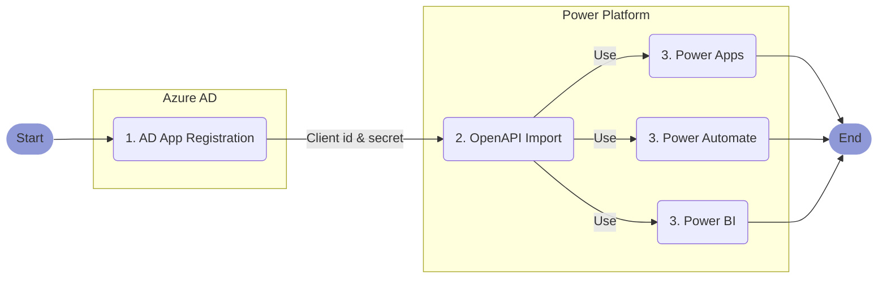

# Setup the Automation Connector for Power Platform

**Abstract**  
This article explains how to register the nBold Connector as a custom connector for Microsoft [Power Platform](https://powerplatform.microsoft.com).

::: tip ⏱ Expected Duration
Creating the custom connector only requires a few operations that are described hereafter as a detailed step-by-step procedure. Assuming you have all the required access and permissions to execute it properly, it should take **_less than 10 minutes_**.
:::

***

**TABLE OF CONTENTS**:
\[\[toc\]\]

***

## Procedure Overview

Here is an overview of the overall procedure:



## 1. Create a new app registration in Azure Active Directory

To securely access your Microsoft 365 environment through the Microsoft Graph APIs, the first step is to create a dedicated app registration. An Azure AD app registration identifies a third-party app such as nBold, and defines the permissions you wan to grant to it. To learn more, you can refer to [How and why applications are added to Azure AD](https://docs.microsoft.com/en-us/azure/active-directory/develop/active-directory-how-applications-are-added).

To create a new app registration, follow these steps:

* Open your [Azure Active Directory portal](https://portal.azure.com/#blade/Microsoft_AAD_IAM/ActiveDirectoryMenuBlade/Overview)
* Select `App registrations` from the left menu
* Click `New registration` from the top bar
* Give the app a name, such as:

***

    nBold Power Platform Connector

***

* Select the option `Accounts in this organizational directory only`, as you want to restrict access to your own tenant.
* Use this web redirection URL:

***

    https://global.consent.azure-apim.net/redirect

***

* Click `Register`
* From the `Overview` menu, copy the `Application (client) ID`, and keep it as we're gonna reuse it later. You can temporarily paste it here:

**Application (client) ID**:  
<input type="text" id="clientIdInput" style="width: 500px;" placeholder="Paste your Application ID here"></input>

* Open the `Authentication` menu
* Ensure that the `Access tokens (used for implicit flows)` and `ID tokens (used for implicit and hybrid flows)` options are checked from the `Implicit grant and hybrid flows` section, and save your updates if required.
* Open the `Certificates and secrets` menu and click `New client secret`. A client secret is a kind of a password for your app, so manage it carefully.
* Give a name to your client secret such as:

***

    nBold Power Platform Connector client secret

***

* Select the expiration option, and click `Add`
* Copy the `Secret Value` value (be careful, it will only be shown once), and keep it as we're gonna reuse it later. You can temporarily paste it here:

::: warning Be careful
You should use the `Secret Value`, not the `Secret ID`!


:::

**Secret value**:  
<input type="text" style="width: 500px;" placeholder="Paste your secret value here"></input>

* Open the `API permissions` from the left menu and click `Add a permission` from the top bar
* Select `Microsoft Graph`, then `Delegated permissions`
* From the permissions list, select:
  * OpenId permissions >
    * `email`
    * `offline_access`
    * `openid`
    * `profile`
  * Directory >
    * `Directory.AccessAsUser.All`
  * Group >
    * `Group.ReadWrite.All`
  * InformationProtectionPolicy >
    * `InformationProtectionPolicy.Read`
  * Mail >
    * `Mail.Send`
  * User >
    * `User.Read`
    * `User.Read.All`
* Click `Add permissions`
* Then click `Grant admin consent for...` then `Yes`

You're done, you've created your app registration for the nBold Connector. You should also have saved for later the `Application (client) ID` and `Client secret` that we're gonna use in the next steps.

## 2. Import the nBold OpenAPI definition

Now that we've created the app registration, we're gonna use it to create our custom connector.

* To import the nBold API OpenAPI definitions for Power Automate and Power Apps, go to [PowerApps](https://powerapps.com) or [Power Automate](https://flow.microsoft.com).

::: tip
The custom connector you're about to create will be available for both PowerApps and Power Automate, as they're sharing the same list of connectors.
:::

* In the navigation pane, select `Data` then `Custom connectors`.
* Select `New custom connector` then choose `Import an OpenAPI from URL`
* Give your connector a name, such as :

***

    nBold

***

* Paste this URL:

***

    https://docs.nbold.co/api/latest/definition/power-platform/apiDefinition.swagger.json

***

* Click `Import`, then `Continue`
* Upload the connector logo that you can download from:

***

    https://nbold.co/wp-content/uploads/2020/12/Logo_degrade_blanc.svg

***

* Set the icon background color to:

***

    #000000

***

* Click `Security`
* Ensure that the authentication type is set to `OAuth 2.0` and the identity provider is set to `Azure Active Directory`
* Paste the previously copied `Client id` and `Client secret`
* Ensure that the login url is set to:

***

    https://login.windows.net

***

* Ensure that the tenant ID is set to:

***

`common`

* Set the resource URL to:

***

    https://graph.microsoft.com

***

* Set the scope to:

***

    https://graph.microsoft.com/.default

***

* Click `Create connector`, then `Close`

## 3. Update the Power Platform Connector

To update your Power Platform connector:

* Open the updated <a target="_blank" href="https://docs.nbold.co/api/latest/definition/power-platform/apiDefinition.swagger.json">connector definition</a>

***

```sh
https://docs.nbold.co/api/latest/definition/power-platform/apiDefinition.swagger.json
```

***

* Copy the whole content
* From Power Apps or Power Automate, open your custom connector from the `Data \ Custom connectors` menu
* Click on `Swagger Editor`
* From the left page, replace the content by pasting the updated connector definition
* Click `Update connector`

## 4. Next Steps

Now that you've created the nBold connector, you can use it from [Power Apps](https://powerapps.com), [Power Automate](https://flow.microsoft.com), and [Power BI](https://powerbi.microsoft.com). See the available [Triggers and Actions](/automation/automation-connectors-actions.md) for reference.

::: tip 💡 To Go Further
Here are a few interesting articles that may give you some guidelines and new ideas on how to use the nBold Connector:

* [Power Automate with Microsoft Teams: The Full Tutorial with Examples](https://nbold.co/power-automate-with-microsoft-teams-the-full-tutorial-with-examples/)
* [Get started with Power Automate](https://docs.microsoft.com/en-us/power-automate/getting-started)
* [Power BI with Microsoft Teams: How to Manage Reports Effectively](https://nbold.co/power-bi-with-microsoft-teams-how-to-manage-reports-effectively/)
  :::

## Update your connector authentication

#### **Issue:**

In case your Power Automate flow stops working, one of the possible reasons for that issue can be an **expiration of a Power Automate connector authentification.**

You can check it by looking at your client secret expiration date in Azure Active Directory.

* Go to App registration in your Azure Active Directory portal [https://portal.azure.com/#view/Microsoft_AAD_IAM/ActiveDirectoryMenuBlade/\~/RegisteredApps](https://portal.azure.com/#view/Microsoft_AAD_IAM/ActiveDirectoryMenuBlade/\~/RegisteredApps "https://portal.azure.com/#view/Microsoft_AAD_IAM/ActiveDirectoryMenuBlade/~/RegisteredApps")
* Select your connector 
* Click on Certificates & Secrets and check when your client secret has expired.

#### **Solution :**

* If it is the case, you need to modify a secret value in the already excising connector in Power Automate, so that it is valid for 24 months.

#### **Actions to do :**

* Go to Azure Active Directory portal ==> App registration ==> Select your connector ==> Certificates & Secrets
* Add a new client secret that expires in 24 months


* And then re-try the authentification:
  * Go to Power Automate [https://emea.flow.microsoft.com/en-us/](https://emea.flow.microsoft.com/en-us/ "https://emea.flow.microsoft.com/en-us/")
  * Click Data ==> Custom Connectors
  * Select your nBold connector

  
  * Click on Edit 

  
  * Go to the Security tab, scroll down, and click edit 

  
  * Change Client secret with a new secret value
  * Update a connector


It should be all up and running now 😉