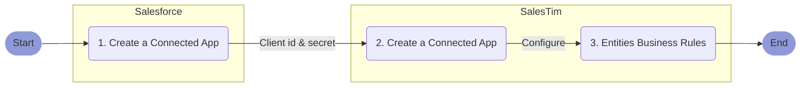

#  Salesforce Sales Cloud <Badge text="v1.0" type="tip" vertical="top"/>

**Abstract**  
This article explains how to configure the SalesTim `Connected App` for Salesforce Sales Cloud.

::: tip ⏱ Expected Duration
It only requires a few operations that are described hereafter as a detailed step-by-step procedure. Assuming you have all the required access and permissions to execute it properly, it should take ***less than 10 minutes***.
:::

---

**TABLE OF CONTENTS**:
[[toc]]

---

## Procedure Overview
Here is an overview of the overall procedure:



## Create a new Salesforce Connected App

1. Open your Salesforce `setup` page, enter 'Apps' in the Quick Find box, and select `App Manager`.
2. Click `New Connected App`.
3. Enter 'SalesTim' as a the connected app’s name
    - This name is displayed in the App Manager and on its App Launcher tile.
    - The connected app name must be unique within your org.
    - If the connected app was created in the Spring ‘14 release or later, you can reuse the name of a deleted connected app.
4. Enter 'SalesTim' as the `API name`.
    - It defaults to a version of the name without spaces.
    - Only letters, numbers, and underscores are allowed, so if the original app name contains any other characters, edit the default name.
5. Enter your own email or any other email as the `Contact Email` for Salesforce to use in case we want to contact you or your support team.
    - This address isn’t given to Salesforce admins who install the app.
6. (Optional) Enter the `Contact Phone` for Salesforce to use in case we want to contact you or your support team.
    - This number isn’t given to Salesforce admins who install the app.
7. (Optional) Paste this address as the `Logo Image Url`:
    ```
    https://docs.nbold.co/color.png
    ```
    - This  logo also displays on the consent page that users see when approving the app.
    - The logo URL must use HTTPS.
    - The logo image must be a GIF, JPG, or PNG file with a file size that’s preferably under 20 KB and no more than 100 KB. Salesforce resize the image to 128 pixels by 128 pixels, so be sure that you like how it looks. If you don’t supply a logo, Salesforce generates one for you using the app’s initials.
8. (Optional) Paste this address as the `Info Url`:
    ```
    https://docs.nbold.co
    ```
9. (Optional) Paste 'SalesTim App for Salesforce' as the `Description`.

For reference, see [Configure Basic Connected App Settings](https://help.salesforce.com/articleView?id=connected_app_create_basics.htm)

10. From the `API (Enable OAuth Settings)` section, fill the form with the following information:
    - `Enable OAuth Settings`: ✅ Checked
    - `Callback URL`:
    ```
    https://app.salestim.io/connected_apps/auth/authorization_code/callback
    ```
    - `Use digital signatures`: ❌ Unchecked
    - `Selected OAuth Scopes`: Select these scopes
        - `Access and manage your Chatter data (chatter_api)`
        - `Access and manage your data (api)`
        - `Access your basic information (id, profile, email, address, phone)`
        - `Allow access to your unique identifier (openid)`
        - `Perform requests on your behalf at any time (refresh_token, offline_access)`
    - `Require Secret for Web Server Flow`: ❌ Unchecked
    - `Introspect All Tokens`: ❌ Unchecked
    - `Configure ID Token`: ❌ Unchecked
    - `Enable Asset Tokens`: ❌ Unchecked
    - `Enable Single Logout`: ❌ Unchecked
11. Wait for two to ten minutes before using this new Salesforce connected app

For reference, see [Enable OAuth Settings for API Integration](https://help.salesforce.com/articleView?id=connected_app_create_api_integration.htm)

12. From the `API (Enable OAuth Settings)` section:
    - copy `Consumer Key`
    - next to the `Consumer Secret` field, click `Click to reveal` and copy the consumer key

## Create a new SalesTim Connected App
From the SalesTim "Connected Apps" tab:
- Click "New Connected App".
- From the "Salesforce Sales Cloud" card, click "Connect"

From the new "Connection" section:
- Paste the `Consumer Key` to the `Client ID` field
- Paste the `Consumer Secret` to the `Client Secret` field
- Click "Authorize"

Once your Salesforce Sales Cloud connection is authorized, you can configure your business rules for each available object type.

## Configure Entities Business Rules
Each entity has its own available actions and schema. We tried hard to make it self-explanatory but if you have any doubt or question, lease refer to our [Help Center](https://help.salestim.com)
