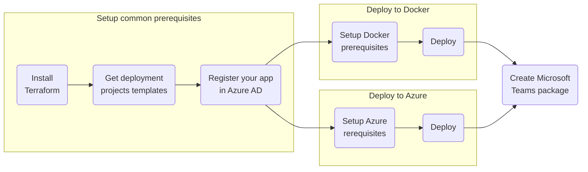

# Getting Started

**TABLE OF CONTENTS**
[[TOC]]

---

## Deployment overview
nBold is designed to be self-hosted from:
- A local or remote Docker service
- Your Microsoft Azure tenant

Here is an overview of the different steps to deploy a nBold environment:

::: tip
**`nBold Self-Hosted` comes with batteries included!**
You don't have to be a Docker or Azure expert to run your own nBold platform!
You should just have a basic understanding of the command-line and networking to successfully set up your own full-featured environment.
:::

This getting started tutorial will guide you through the different steps required to setup the minimal common prerequisites.

## Next steps
Install the [common prerequisites](./common_prerequisites).
