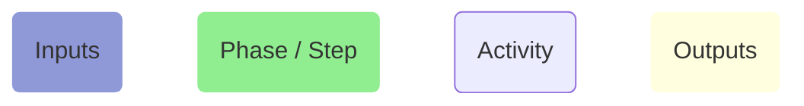

# Provisioning Job

**TABLE OF CONTENTS**

[[toc]]

---

## Process overview

A simplified representation of a provisionning job is comprised of the following activities:

```mermaid
flowchart TB

    %% Nodes

    subgraph in[Inputs]
        teams(Microsoft Teams client<br>Desktop, web, mobile)
        apps(3rd-party apps<br>Custom, Power Automate)
    end

    pre(Pre-processing)
    checkteam(Check the source team, status and access)
    checkcloning(Control the structure and contents to clone)
    checktemplate(Validate template configuration)
    checknaming(Control the naming convention)
    checklocale(Define the appropriate language)
    checkapproval(Approval required?)

    approval(Approval)

    processing(Processing)
    creategroup(Create group with the appropriate geo)
    createteam(Create the team)
    privacy(Apply privacy public / private)
    email(Apply email convention to the underlying group)
    sensitivity(Apply sensitivity labels)
    photo(Update team picture)
    files(Clone files and folders)
    installapps(Install required apps associated with tabs)
    tabs(Configure and provision all the tabs)

    post(Post-processing)
    requesterteam(Invite the requester as a member of the team)
    requestedmembersteam(Invite requested members to the team)
    permanentmembersteam(Invite permanent members to the team)
    requesterchannels(Invite the requester to every channel)
    requestedmemberschannels(Invite requested members to every channel)
    permanentmemberschannels(Invite permanent members to every channel)

    subgraph out[Outputs]
        audit(Audit trails)
        notif(Notification in Teams)
    end
    
    done(End)

    %% Links

    teams -->|Triggers| pre
    apps -->|Triggers| pre

    pre --> checkteam
    checkteam --> checkcloning
    checkcloning --> checktemplate
    checktemplate --> checknaming
    checknaming --> checklocale
    checklocale --> checkapproval
    checkapproval -->|Yes| approval
    approval -->|Approved| processing
    approval -->|Rejected| theend(Done)
    checkapproval -->|No| processing


    processing --> creategroup
    creategroup --> createteam
    createteam --> privacy
    privacy --> email
    email --> sensitivity
    sensitivity --> photo
    photo --> files
    files --> installapps
    installapps --> tabs
    tabs --> post

    post --> requesterteam 
    requesterteam --> requestedmembersteam
    requestedmembersteam --> permanentmembersteam
    permanentmembersteam --> requesterchannels
    requesterchannels --> requestedmemberschannels
    requestedmemberschannels --> permanentmemberschannels

    permanentmemberschannels --> done

    pre --> out
    processing --> out
    post --> out
    done --> out

    %% Styles

    classDef inputs fill:#9099d8, stroke-width:0px;
        class teams inputs
        class apps inputs
    classDef step fill:#90EE90, stroke-width:0px;
        class pre step
        class processing step
        class post step
        class done step
        class theend step
    classDef outputs fill:#FFFFE0, stroke-width:0px;
        class audit outputs
        class notif outputs
```

**Legend:**

## Inputs
Provisioning jobs execution could be triggered from the following events:
- An end-user is requesting the creation of a new team from a Microsoft Teams client.
- An external system (Custom application, Power Aotomate...) is using nBold's API to request the creation of a new team.

## Pre-processing
During the pre-processing phase, the provisioning job executes controls to make sure that the appropriate configuration has been defined, and that everything is ready for the processing step:
- Controls if the security context gives access to the source team defined in the collaboration template
- Controls if the source team is not archived (as due to a Microsoft Graph bug, it denies access to some settings and contents of the team)
- Controls the structure and contents that have to be cloned as defined in the template
- Controls if the required information are available to apply the naming convention for the team name, team description, email address and welcome message
- Define the appropriate language to be used for end-user notifications
- If an approval is required by the template, triggers the approval job instead of running the provisioning.

## Processing
During the processing phase, the job provisions a new team and all the associated contents:
- Create a group with the appropriate geo (based on the requester PDL or based on a dynamic rule based on the template / requester profile)
- Create a team from the previously created group (aka "teamsify")
- Apply team privacy (public / private)
- Apply the email convention to the underlying group email alias
- Apply sensitivity labels to the underlying group
- Update team picture from the source team
- Clone files and folders from the source team to the newly created one
- Install all the required apps associated with tabs from the source team
- Configure and all the tabs and provision their content if it is supported by the associated app

::: tip Note
Depending on the configuration defined from the `Settings` tab, the provisioning job could be executed in the security context of:
- A registered service account. In this context, the provisioning job uses the permissions defined in the [Service account scope](../references/permissions.html#service-account-scope).
- An Azure AD registered app. In this context, the provisioning job uses the permissions defined in the [Application scope](../references/permissions.html#application-scope).
:::

## Post-processing
During the processing phase, once the team structure and contents are fully provisioned, the job invites the required users to both the team and its channels:
- Invite the requester to the team, as a member / owner depending on the template configuration
- Invite members and owners requested by the requester to the team
- Invite permanent members and owners defined in the template to the team
- Invite the requester as a member / owner to every private and shared channels, depending on the template configuration
- Invite members and owners requested by the requester to every private and shared channels
- Invite permanent members and owners defined in the template to every private and shared channels

## Outputs
During the different phases, the provisioning job generates events that are handled by two different modules:
- The audit trails module creates a new record for each event
- The notification module send a notification in the `general` channel of the created team

To see the list of events generated during the provisioning process, please refer to our [events reference](../references/events_reference).
