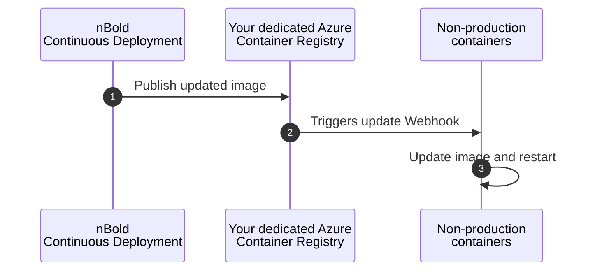
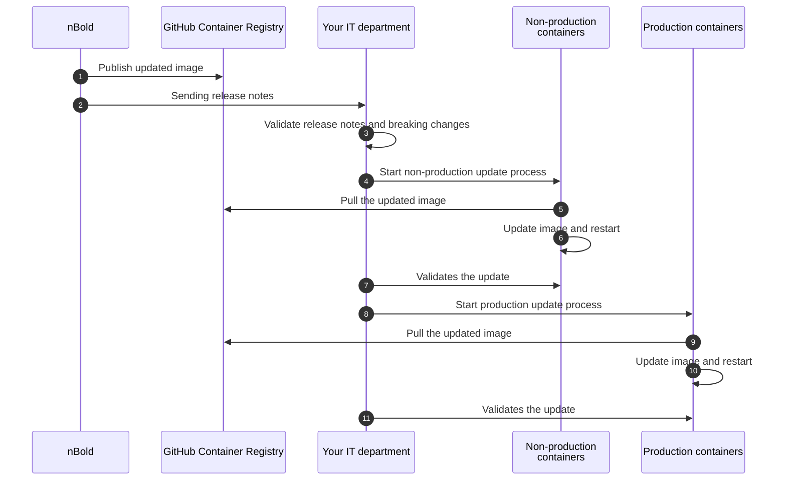

# ♻️ Updates Management

nBold offers two default options to manage upgrades in your environment when we're publishing a new release.

[[toc]]

---

## Live update
The `live update` mode is ideal for non-production environments (such as `QA`, `UAT`, etc.) as you'll continuously receive all the new releases automatically.
In this mode, you'll receive all our updates (features, fixes, patches...) as soon as they're released.

Here's a sequence diagram of the live updates process:

**Legend:**
1. After a new release has been published and tested in our `nBold Cloud` environments, our continuous deployment process pushes this updated image of the application directly to a dedicated Azure Container Registry (`ACR`) hosted in your own Azure tenant.
2. ACR automatically triggers a webhook for each container instance of nBold you're running
3. All your containers are updated automatically.

## Staged update
The `staged update` mode is ideal for production environments as you'll be able to control the entire release process.
In this mode, you'll receive updates between 2 weeks / 1 month after the public release in our own `nBold Cloud` environments, except for hotfixes and security patches that will be released at the same time as our own production environments.

Here's a sequence diagram of the staged updates process:

**Legend:**
1. After a new release has been published and tested in our `nBold Cloud` environments, our continuous deployment process pushes this updated image of the application to our secured GitHub Container Registry (`GCR`).
2. We're sending the release notes to all our `nBold Self-Hosted` customers.
3. Your IT department validates the release notes and its breaking changes.
4. Once validated, your IT department starts the non-production update process
5. The non-production containers are pulling the updated nBold image from our GCR
6. Your non-production containers are updated and restarted.
7. Your IT department validates the update in non-production.
8. Once validated in non-production, your IT department starts the production update process
9. The production containers are pulling the updated nBold image from our GCR
10. Your production containers are updated and restarted.
11. Your IT department validates the update in production.

::: tip Specific technical and organizational constraints?
We’re of course available to discuss with you what would be the best solution that encompass your specific technical and organizational constraints.
:::
