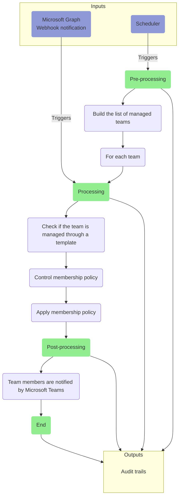
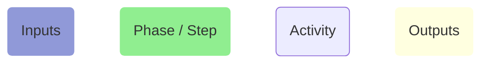

# Permanent Membership Policy Job

**TABLE OF CONTENTS**

[[toc]]

---

## Process overview

A simplified representation of a permanent membership policy job is comprised of the following activities:

**Legend:**

## Inputs
Permanent membership policy jobs execution could be triggered from the following events:
- The Microsoft Graph notifies SalesTim through a webhook that a team membership has been updated.
- SalesTim's internal scheduler makes sure (as a fallback mechanism) that the permanent membership policy, if defined, is applied to managed teams.

## Pre-processing
During the pre-processing phase, the permanent membership policy job executes controls to make sure that the appropriate configuration has been defined, and that everything is ready for the processing step:
- Build the list of managed teams that have a valid permanent membership policy defined
- Once built, the processing phase is started for each team

## Processing
During the processing phase, the job applies if necessary the permanent membership policy defined in the associated template:
- Validate if the team is associated with a template
- Validate if this template has a valid permanent membership policy
- Apply the permanent membership policy to the team if necessary

::: tip Note
Depending on the configuration defined from the `Settings` tab, the permanent membership policy job could be executed in the security context of:
- A registered service account. In this context, the provisioning job uses the permissions defined in the [Service account scope](../references/permissions.html#service-account-scope).
- An Azure AD registered app. In this context, the provisioning job uses the permissions defined in the [Application scope](../references/permissions.html#application-scope).
:::

## Post-processing
The permanent membership policy doesn't notify users directly to prevent duplicated notifications. Instead, it relies on the native Microsoft Teams notifications / messages generated when membership of a team is updated.

## Outputs
During the different phases, the permanent membership policy job generates events that are handled by the audit trails module, that creates a new record for each event.

To see the list of events generated during the execution of the permanent membership policy job, please refer to our [events reference](../references/events_reference).
