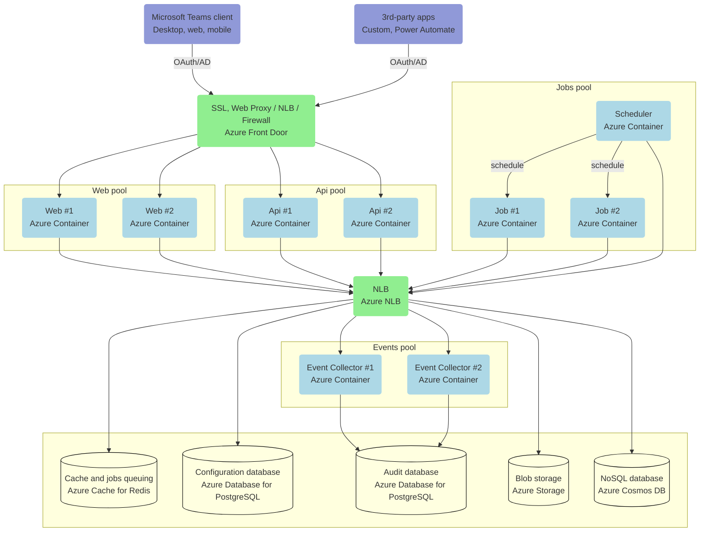
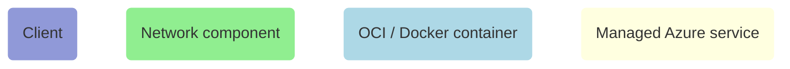
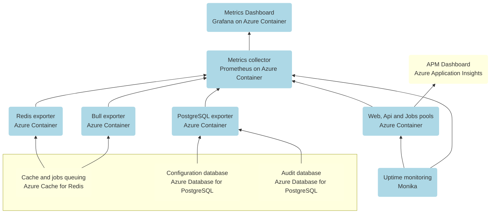

# Architecture

nBold is a multi-tier platform that relies on [independent services](/hosting/references/services-reference.md) to support high-availability and scale with ease.

**TABLE OF CONTENTS**

[[toc]]

---

## Core components
At a glance, a basic and minimal nBold production environment (without operations/monitoring tools) would be comprised of these different elements:

**Legend:**

Notes:
- Azure containers could be hosted on either `Azure App Service` or `Azure Container Instances`
- Deployment could be executed manually, using our Terraform [deployment project templates](/hosting/installation/azure-deployment.md) for Azure, or using any orchestrator such as [Azure Kubernetes Service (AKS)](https://azure.microsoft.com/en-us/services/kubernetes-service/).
- A complete list of components is available in our [Azure deployment resources](/hosting/references/azure-resources-reference.md) documentation.

## Monitoring components
In addition to the previous architecture diagram, here we're presenting the most common additional operations services, for auditing, uptime monitoring and APM (Application Performance Management):

::: tip
Learn more out how to operate a nBold infrastructure using our operations manual, especially [Updates management](../operations/updates_management) and [monitoring](../operations/monitoring)
:::

## Design Principles
Here are the key tenets that drived the design of this architecture.

### Security first
We're enforcing maximum security at each level by applying zero-trust, even if it implies to perform advanced and complex technical operations.

### Infrastructure as code
All our infrastructure resources are defined by code, using the Terraform [HCL](https://www.terraform.io/docs/language/syntax/configuration.html) language from [HashiCorp](https://www.hashicorp.com/), resulting in a consistent, reliable and controlled deployment process.

### Self-contained
To guarantee data residency, the platform could be operated in a fully self-contained environment that doesn't rely on any external service. Technically, the solution could be executed in one single isolated Docker environment.

### Scalability
As a multi-tier platform, each tier (web, api, jobs...) could scale horizontally independently by increasing the number of containers with the same role. In addition, this whole architecture could be replicated across multiple Azure regions to allocate and distribute the workload across multiple environments.

### Resiliency
All the operations are processed through message queues that brings advanced logging and retry capabilities in case of failure (Throttling, networking issue, Microsoft Graph bugs or unavailability…).

### We don't trust external services
Based on our experience, our design strategy regarding the Microsoft Graph may be summarized in one sentence:​
> We don’t trust blindly the Microsoft Graph!
