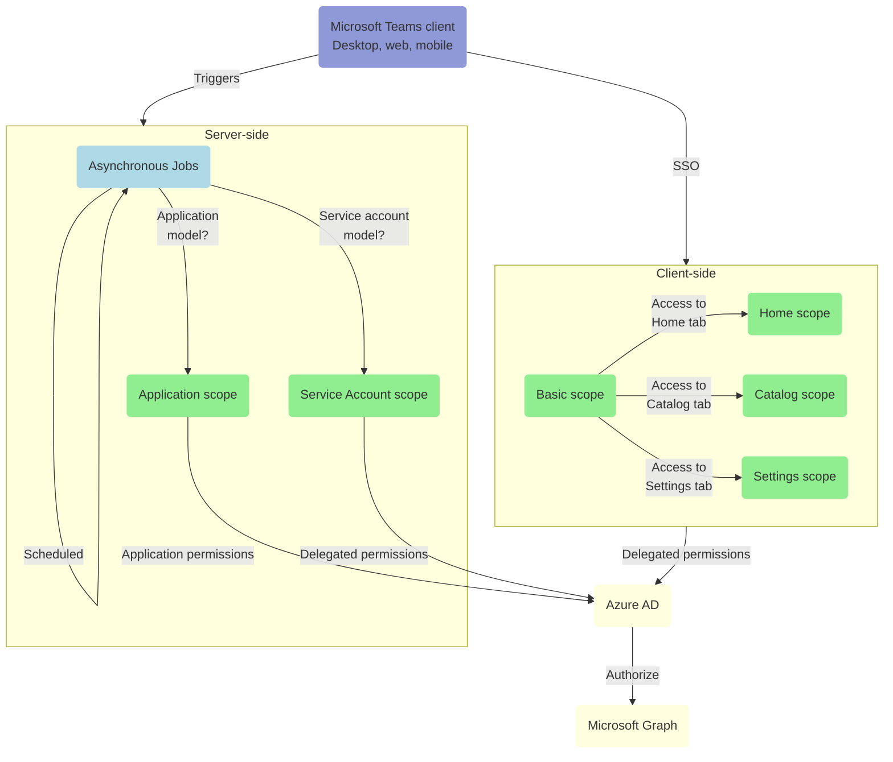
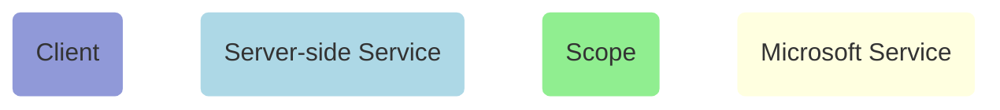

# 🔐 Permissions Reference

For SalesTim to access and process data from the Microsoft Graph, your administrator must grant the appropriate permissions via a consent process.  

**TABLE OF CONTENTS**

[[toc]]

---

## Understanding permissions scopes

To comply with the principle of "least-privilege", and request the minimum required permissions to perform specific operations, SalesTim defines different permissions scopes that it will use in different contexts.

Here is a diagram describing in which context each scope is requested:

**Legend:**

## Basic scope

From the SalesTim app for Microsoft Teams, a user is authenticated using the [Tabs SSO mechanism](https://docs.microsoft.com/en-us/microsoftteams/platform/tabs/how-to/authentication/auth-aad-sso). Through this SSO process, a limited set of user-level OpenID permissions is granted, namely `email`, `profile`, `offline_access`, and `openid`.

This basic scope is requested by the SalesTim app once the user is authenticated, to access any of its tabs:

| Permission | Type | Origin | Justification | Admin Consent Required |
|------------|------|--------|---------------|:----------------------:|
| `openid` | Delegated | OpenID | Allows SalesTim to sign-in a user. | No |
| `offline_access` | Delegated | OpenID | Allows SalesTim to retreive a refresh token used to refresh the access token of the current user from the application web client. | No |
| `email` | Delegated | OpenID | Allows SalesTim to read the email address of the current user. | No |
| `profile` | Delegated | OpenID | Allows SalesTim to read the basic profile (name, picture, user name) of the current user. | No |
| `User.ReadBasic.All` | Delegated | Microsoft Graph | Allows SalesTim to retreive the list of users from the directory, used when a user is requesting a new team and wants to add members and owners. | No |
| `Team.ReadBasic.All` | Delegated | Microsoft Graph | Allows SalesTim to retreive the list of teams a user is a member of, used to show the list of teams from the `Home` tab of the SalesTim app. | No |
| `Channel.ReadBasic.All` | Delegated | Microsoft Graph | Allows SalesTim to retreive the list of channels from the teams a user is a member of, used to show the list of channels for each team from the `Home` tab of the SalesTim app. | No |

## Home scope
 scope

In addition to the basic scope, when a user is trying to access the `Home` tab, SalesTim requests the following additional permissions:

| Permission | Type | Origin | Justification | Admin Consent Required |
|------------|------|--------|---------------|:----------------------:|
| `TeamSettings.Read.All` | Delegated | Microsoft Graph | Allows SalesTim to retreive the settings of teams a user is a member of, used to show some teams settings from the `Home` tab of the SalesTim app. | Yes |
| `TeamMember.Read.All` | Delegated | Microsoft Graph | Allows SalesTim to retreive the members (owners, members and guests) of teams a user is a member of, used to show teams members from the `Home` tab of the SalesTim app. | Yes |
| `ChannelMember.Read.All` | Delegated | Microsoft Graph | Allows SalesTim to retreive the members (owners, members and guests) of channels (private, shared) from teams a user is a member of, used to show some teams members from the `Home` tab of the SalesTim app. | Yes |
| `ChannelSettings.Read.All` | Delegated | Microsoft Graph | Allows SalesTim to retreive the settings of channels from teams a user is a member of, used to show some channels settings from the `Home` tab of the SalesTim app. | Yes |
| `TeamsTab.Read.All` | Delegated | Microsoft Graph | Allows SalesTim to retreive the tabs included in channels from teams a user is a member of, used to show some tabs settings from the `Home` tab of the SalesTim app. | Yes |

## Catalog scope

In addition to the basic scope, when a user is trying to access the `Catalog` tab (and of course if the user was granted the `Catalog Manager` role from the RBAC settings), SalesTim requests the following additional permissions:

| Permission | Type | Origin | Justification | Admin Consent Required |
|------------|------|--------|---------------|:----------------------:|
| `InformationProtectionPolicy.Read` | Delegated | Microsoft Graph | Allows the catalog manager to select a sensitivity label from a list (Seeing only the labels he has access to) to associate with a collaboration template. | Yes |

## Settings scope

When a user is trying to access the `Settings` tab (and of course if the user was granted the `Global Administrator` or the `Teams Administrator` role), SalesTim only requests the permissions from the `Basic scope` as the only required permission is `User.ReadBasic.All` (already included in `Basic scope`)

## Service account scope

If the application is executed in the context of a service account model, when an administrator is registering the service account from the `Settings` tab, SalesTim requests the following `delegated` permissions as part of the admin consent process:

| Permission | Type | Origin | Justification | Admin Consent Required |
|------------|------|--------|---------------|:----------------------:|
| `openid` | Delegated | OpenID | Allows SalesTim to sign-in the service account. | No |
| `offline_access` | Delegated | OpenID | Allows SalesTim to retreive a refresh token used to refresh the access token of the service account. | No |
| `email` | Delegated | OpenID | Allows SalesTim to read the email address of the service account. | No |
| `profile` | Delegated | OpenID | Allows SalesTim to read the basic profile (name, picture, user name) of the service account. | No |
| `Mail.Send` | Delegated | Microsoft Graph | If an organization-level provider has been defined from the `Settings` tab, the team creation approval emails will be sent by the service account itself (instead of sending emails through an external mailer service) | No |
| `User.Read.All` | Delegated | Microsoft Graph | Allows the service account to search for users in the directory. | Yes |
| `Group.ReadWrite.All` | Delegated | Microsoft Graph | Allows the service account to perform administrative operations (especially applying sensitivity or retention labels, applying groups policies...) on the groups associated with teams. | Yes |
| `InformationProtectionPolicy.Read` | Delegated | Microsoft Graph | Allows the service account to retreive and apply (granted he has the required licenses) sensitivity labels to teams. | No |
| `Team.Create` | Delegated | Microsoft Graph | Allows the service account to create new teams. | Yes |
| `TeamSettings.ReadWrite.All` | Delegated | Microsoft Graph | Allows the service account to retreive and update teams settings. | Yes |
| `TeamsAppInstallation.ReadWriteForTeam` | Delegated | Microsoft Graph | Allows the service account to install apps in a team to provision new tabs during the provisioning process. | Yes |
| `TeamMember.ReadWrite.All` | Delegated | Microsoft Graph | Allows the service account to manage members of teams. | Yes |
| `TeamsTab.ReadWrite.All` | Delegated | Microsoft Graph | Allows the service account to create and manage tabs as part of the provisioning process. | Yes |
| `Channel.Create` | Delegated | Microsoft Graph | Allows the service account to create and manage channels as part of the provisioning process. | Yes |
| `ChannelSettings.ReadWrite.All` | Delegated | Microsoft Graph | Allows the service account to manage channels settings. | Yes |
| `ChannelMember.ReadWrite.All` | Delegated | Microsoft Graph | Allows the service account to manage channels members. | Yes |

Please refer to our Tech Hub to learn more about the [Service Account minimal requirements](https://developers.salestim.com/platform/apppermissions.html#service-account).

## Application scope

If the application is executed in the context of an application model, when an administrator is granting the app its required permissions as part of the admin consent process, SalesTim requests the following `application` permissions (application permissions can only be granted through an admin consent process):

| Permission | Type | Origin | Justification | Admin Consent Required |
|------------|------|--------|---------------|:----------------------:|
| `Mail.Send` | Application | Microsoft Graph | If an organization-level provider has been defined from the `Settings` tab, the team creation approval emails will be sent by the application on behalf of a user (instead of sending emails through an external mailer service) | Yes |
| `User.Read.All` | Application | Microsoft Graph | Allows the application to search for users in the directory. | Yes |
| `Group.ReadWrite.All` | Delegated | Microsoft Graph | Allows the application to perform administrative operations (especially applying sensitivity or retention labels, applying groups policies...) on the groups associated with teams. | Yes |
| `InformationProtectionPolicy.Read` | Delegated | Microsoft Graph | Allows the application to retreive and apply sensitivity labels to teams. | No |
| `Team.Create` | Delegated | Microsoft Graph | Allows the application to create new teams. | Yes |
| `TeamSettings.ReadWrite.All` | Delegated | Microsoft Graph | Allows the application to retreive and update teams settings. | Yes |
| `TeamsAppInstallation.ReadWriteForTeam` | Delegated | Microsoft Graph | Allows the application to install apps in a team to provision new tabs during the provisioning process. | Yes |
| `TeamMember.ReadWrite.All` | Delegated | Microsoft Graph | Allows the application to manage members of teams. | Yes |
| `TeamsTab.ReadWrite.All` | Delegated | Microsoft Graph | Allows the application to create and manage tabs as part of the provisioning process. | Yes |
| `Channel.Create` | Delegated | Microsoft Graph | Allows the application to create and manage channels as part of the provisioning process. | Yes |
| `ChannelSettings.ReadWrite.All` | Delegated | Microsoft Graph | Allows the application to manage channels settings. | Yes |
| `ChannelMember.ReadWrite.All` | Delegated | Microsoft Graph | Allows the application to manage channels members. | Yes |
