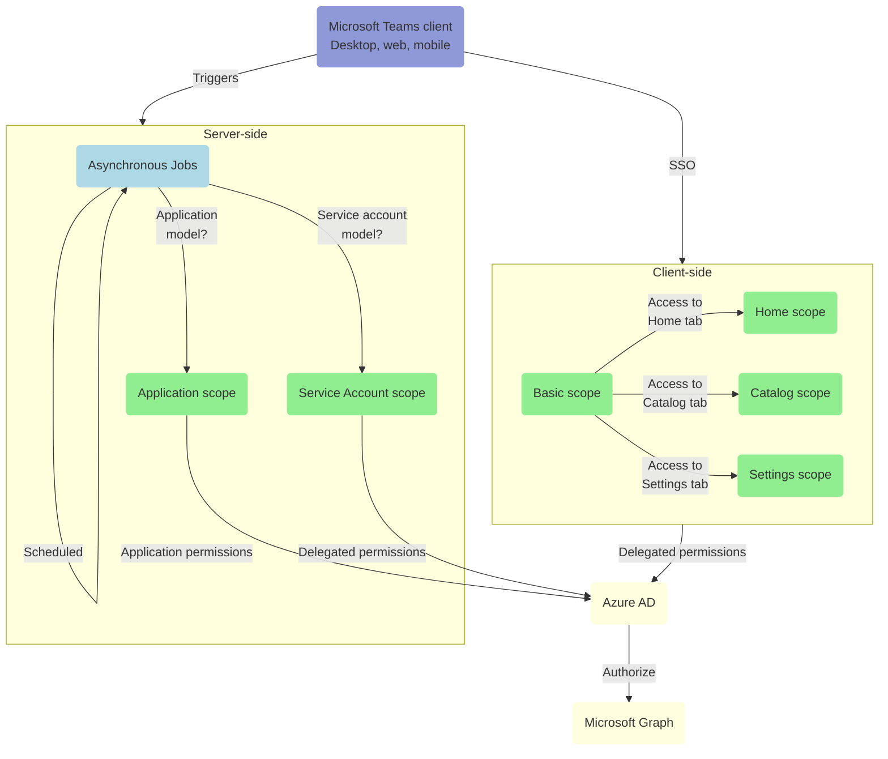
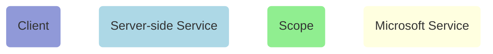

# Microsoft Graph Permissions

---

**TABLE OF CONTENTS**
[[toc]]

---

## Understanding permissions scopes

To comply with the principle of "least-privilege", and request the minimum required permissions to perform specific operations, nBold defines different permissions scopes that it will use in different contexts.

Here is a diagram describing in which context each scope is requested:



**Legend:**



---

:::tip Understanding admin-restricted permissions
Depending on the permission type (Delegated or Application), some high-privilege permissions in the Microsoft ecosystem are set to admin-restricted.  
Examples of these kinds of permissions include the following:
- Read all user's full profiles by using ```User.Read.All```
- Write data to an organization's directory by using ```Directory.ReadWrite.All```
- Read all groups in an organization's directory by using ```Groups.Read.All```

For nBold to access data in Microsoft Graph, your administrator must grant it the correct permissions via a consent process.  

Learn more:
- [nBold Install and Setup Guide...](https://docs.nbold.co/articles/3505270-install-salestim-app-on-microsoft-teams)
- [Azure AD application consent experience...](https://docs.microsoft.com/en-us/azure/active-directory/develop/application-consent-experience)
- [Microsoft Graph permissions reference...](https://docs.microsoft.com/en-us/graph/permissions-reference)
:::

## Basic scope

From the nBold app for Microsoft Teams, a user is authenticated using the [Tabs SSO mechanism](https://docs.microsoft.com/en-us/microsoftteams/platform/tabs/how-to/authentication/auth-aad-sso). Through this SSO process, a limited set of user-level OpenID permissions is granted, namely `email`, `profile`, `offline_access`, and `openid`.

This basic scope is requested by the nBold app once the user is authenticated, to access any of its tabs:

| Permission | Type | Origin | Justification | Admin Consent Required |
|------------|------|--------|---------------|:----------------------:|
| `openid` | Delegated | OpenID | Allows nBold to sign-in a user. | No |
| `offline_access` | Delegated | OpenID | Allows nBold to retreive a refresh token used to refresh the access token of the current user from the application web client. | No |
| `email` | Delegated | OpenID | Allows nBold to read the email address of the current user. | No |
| `profile` | Delegated | OpenID | Allows nBold to read the basic profile (name, picture, user name) of the current user. | No |
| `User.ReadBasic.All` | Delegated | Microsoft Graph | Allows nBold to retreive the list of users from the directory, used when a user is requesting a new team and wants to add members and owners. | No |
| `Team.ReadBasic.All` | Delegated | Microsoft Graph | Allows nBold to retreive the list of teams a user is a member of, used to show the list of teams from the `Home` tab of the nBold app. | No |
| `Channel.ReadBasic.All` | Delegated | Microsoft Graph | Allows nBold to retreive the list of channels from the teams a user is a member of, used to show the list of channels for each team from the `Home` tab of the nBold app. | No |


## Home scope

In addition to the basic scope, when a user is trying to access the `Home` tab, nBold requests the following additional permissions:

| Permission | Type | Origin | Justification | Admin Consent Required |
|------------|------|--------|---------------|:----------------------:|
| `TeamSettings.Read.All` | Delegated | Microsoft Graph | Allows nBold to retreive the settings of teams a user is a member of, used to show some teams settings from the `Home` tab of the nBold app. | Yes |
| `TeamMember.Read.All` | Delegated | Microsoft Graph | Allows nBold to retreive the members (owners, members and guests) of teams a user is a member of, used to show teams members from the `Home` tab of the nBold app. | Yes |
| `ChannelMember.Read.All` | Delegated | Microsoft Graph | Allows nBold to retreive the members (owners, members and guests) of channels (private, shared) from teams a user is a member of, used to show some teams members from the `Home` tab of the nBold app. | Yes |
| `ChannelSettings.Read.All` | Delegated | Microsoft Graph | Allows nBold to retreive the settings of channels from teams a user is a member of, used to show some channels settings from the `Home` tab of the nBold app. | Yes |
| `TeamsTab.Read.All` | Delegated | Microsoft Graph | Allows nBold to retreive the tabs included in channels from teams a user is a member of, used to show some tabs settings from the `Home` tab of the nBold app. | Yes |


## Catalog scope

In addition to the basic scope, when a user is trying to access the `Catalog` tab (and of course if the user was granted the `Catalog Manager` role from the RBAC settings), nBold requests the following additional permissions:

| Permission | Type | Origin | Justification | Admin Consent Required |
|------------|------|--------|---------------|:----------------------:|
| `InformationProtectionPolicy.Read` | Delegated | Microsoft Graph | Allows the catalog manager to select a sensitivity label from a list (Seeing only the labels he has access to) to associate with a collaboration template. | Yes |


## Settings scope

When a user is trying to access the `Settings` tab (and of course if the user was granted the `Global Administrator` or the `Teams Administrator` role), nBold only requests the permissions from the `Basic scope` as the only required permission is `User.ReadBasic.All` (already included in `Basic scope`)


## Service account scope

If the application is executed in the context of a service account model, when an administrator is registering the service account from the `Settings` tab, nBold requests the following `delegated` permissions as part of the admin consent process:

| Permission | Type | Origin | Justification | Admin Consent Required |
|------------|------|--------|---------------|:----------------------:|
| `openid` | Delegated | OpenID | Allows nBold to sign-in the service account. | No |
| `offline_access` | Delegated | OpenID | Allows nBold to retreive a refresh token used to refresh the access token of the service account. | No |
| `email` | Delegated | OpenID | Allows nBold to read the email address of the service account. | No |
| `profile` | Delegated | OpenID | Allows nBold to read the basic profile (name, picture, user name) of the service account. | No |
| `Mail.Send` | Delegated | Microsoft Graph | If an organization-level provider has been defined from the `Settings` tab, the team creation approval emails will be sent by the service account itself (instead of sending emails through an external mailer service) | No |
| `User.Read.All` | Delegated | Microsoft Graph | Allows the service account to search for users in the directory. | Yes |
| `Group.ReadWrite.All` | Delegated | Microsoft Graph | Allows the service account to perform administrative operations (especially applying sensitivity or retention labels, applying groups policies...) on the groups associated with teams. | Yes |
| `InformationProtectionPolicy.Read` | Delegated | Microsoft Graph | Allows the service account to retreive and apply (granted he has the required licenses) sensitivity labels to teams. | No |
| `Team.Create` | Delegated | Microsoft Graph | Allows the service account to create new teams. | Yes |
| `TeamSettings.ReadWrite.All` | Delegated | Microsoft Graph | Allows the service account to retreive and update teams settings. | Yes |
| `TeamsAppInstallation.ReadWriteForTeam` | Delegated | Microsoft Graph | Allows the service account to install apps in a team to provision new tabs during the provisioning process. | Yes |
| `TeamMember.ReadWrite.All` | Delegated | Microsoft Graph | Allows the service account to manage members of teams. | Yes |
| `TeamsTab.ReadWrite.All` | Delegated | Microsoft Graph | Allows the service account to create and manage tabs as part of the provisioning process. | Yes |
| `Channel.Create` | Delegated | Microsoft Graph | Allows the service account to create and manage channels as part of the provisioning process. | Yes |
| `ChannelSettings.ReadWrite.All` | Delegated | Microsoft Graph | Allows the service account to manage channels settings. | Yes |
| `ChannelMember.ReadWrite.All` | Delegated | Microsoft Graph | Allows the service account to manage channels members. | Yes |


## Service Account
A service account is a user identity that is associated with a service executable (such as nBold) for the purpose of providing a security context for that service.

**Why do we NEED a service account?**  
nBold relies intensively on the Microsoft Graph API. Therefore it's important to understand its permissions model and basic requirements.  

**Understand delegated and application permissions**  
Microsoft Graph has two types of permissions:
* ***Delegated permissions*** are used by apps that have a signed-in user present. For these apps either the user or an administrator consents to the permissions that the app requests and the app can act as the signed-in user when making calls to Microsoft Graph. Some delegated permissions can be consented by non-administrative users, but some higher-privileged permissions require administrator consent.
* ***Application permissions*** are used by apps that run without a signed-in user present. For example, apps that run as background services or daemons. Application permissions can only be consented by an administrator.

::: tip
Due to some Microsoft Graph functional and technical limitations, nBold now relies on a delegated permission model. In the future, nBold will switch to an application model.
::: 

Learn more about [Authentication and authorization basics for Microsoft Graph...](https://docs.microsoft.com/en-us/graph/auth/auth-concepts#microsoft-graph-permissions)

**How we're securing it?**
- **Least-Privilege Administrative Models**: Every single requested permission scope is documented and justified.
- **Authentication**: We're not storing any login / password combination, and service account configuration can only be performed by one of your administrators.

**Minimal requirements**  
Service account minimal requirements:
- Must be able to sign-in interactively
  * Why: The service account needs to sign-in from the app to retreive Microsoft Graph access and refresh token.
- Must have at least an active Office 365 E1 license
  * Why: The service account must be a regular Office 365 user to use the Microsoft Graph API in delegated mode.
- Must have an active license to Microsoft Teams
  * Why: To perform administrative operations on Microsoft Teams artefacts.
- Must be assigned at least the `Teams Administrator` role
  * Why: To perform administrative operations on teams/groups, especially gain the "owner" status on any existing teams/group.

**Optional requirements**  
Service account optional requirements:
- Must have an active Exchange Online license and its Exchange Online mailbox provisioned, if the `organization-level provider` option is enabled from the `Approval` section of the `Settings` tab.
  * Why: To send email notifications and actionable messages in a secure way inside customer's domain, respecting internal mail flow rules
- Must have an active Azure AD P1 license, if sensitivity labels are defined in your templates
  * Why: To apply sensitivity labels to your teams/groups

::: tip
Learn how to [setup the service account](/quickstart/set-up-the-service-account.md)
:::

::: warning Password update and MFA (Multi-factor authentication)
If you enforce MFA for the service account or update its password AFTER it has been configured in nBold, you MUST update it from the "Settings" tab using the "🎭 Update" button.
:::

**Is the service account visible to end-users?**  
Even if the service account is performing actions in the background (Such as provisioning and other administrative operations), it may appear to end-user in some cases:
- It is seen as the teams and associated resources (such as planner) creator
- Its profile picture and name appear as the sender of notifications

::: tip
Choose the name you want, this can be the name of your IT Service for instance, and add a nice picture!
:::

## Security Best practices

This list is for sure not exhaustive, but may give you some guidelines on how to secure your service accounts:

### 1. Enforce service account security with MFA
nBold service account supports Multi-Factor Authentication (MFA). MFA adds an additional layer of protection, ensuring that service account declaration or update is done by an authorized person.

### 2. Keep access limited
Ensure you only allocate AD service accounts the minimum privileges they require for the tasks they need to carry out, and don’t give them any more access than is necessary. In many cases you can remove the functionality for remote access, terminal service login, internet access, and remote control rights.

### 3. Create service accounts from scratch.
Don’t create service accounts in Active Directory by copying old ones, as you might accidentally be copying from a service account with much higher privileges than you need. This could lead to security issues and account misuse if you give someone an account with access to resources or information they shouldn’t be privy to.

### 4. Don’t put service accounts in built-in privileged groups.
Putting service accounts in groups with built-in privileges can be risky, because each person in the group will have access to the service account’s credentials. If there’s account misuse, it can be hard to figure out who the offender is. If you need a service account for a privileged group, create a new group with the same privileges and allow access only to the service account.

### 5. Control password configuration.
You can set a service account so the user can’t change their own password. You can also set it so the account can’t be delegated to someone else. This ensures the administrator controls the password, and nobody other than authorized users has access to the account.

### 6. Enable auditing.
Be sure to enable auditing for all service accounts and related objects. Once auditing is enabled, regularly check the logs to see who’s using the accounts, when, and for what purposes. Auditing is one of the most important of the best practices: it helps ensure security, verifies internal processes and compliance measures are being followed, and can discover any issues or breaches before too much time passes.

### 7. Implement access rights management software.
Carefully managing your Active Directory service accounts is crucial to preventing misuse of broad access and privileges. An access rights management tool can be beneficial to ensure user accounts are set up and managed with appropriate permissions and access.

